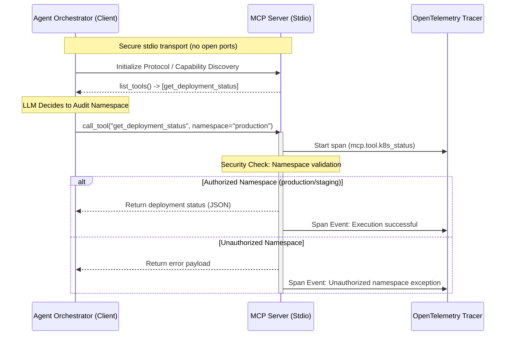

# MCP Agentic Loop Demonstration

This repository contains a simple, secure demonstration of an agentic execution loop using the **Model Context Protocol (MCP)**. It illustrates how an AI Agent Orchestrator can dynamically discover and safely run tools exposed by an internal service—specifically simulated Kubernetes diagnostic commands—with built-in security policies and observability.

## Repository Contents

* **[mcp_agent_client.py](file:///home/asavvop/code/ai-agentic-loop/mcp_agent_client.py)**: Simulates the client-side Agent Orchestrator. It establishes a secure connection to the tool server, performs a protocol handshake, dynamically lists available tools, and executes a tool call.
* **[mcp_k8s_server.py](file:///home/asavvop/code/ai-agentic-loop/mcp_k8s_server.py)**: The MCP server that acts as the gateway to the infrastructure. It uses `FastMCP` to register tools, enforces a namespace security boundary, and instruments operations with OpenTelemetry tracing.

---

## Architecture Overview



### Key Highlights

1. **Zero-Port Security**: The communication between the agent client and server happens entirely over **Standard Input/Output (stdio)**. This eliminates the risk of exposed network ports.
2. **Dynamic Tool Schema injection**: The agent does not hardcode the tool list. Instead, it queries the server using `list_tools()` to dynamically discover capabilities.
3. **Strict Policy Enforcement**: The MCP server handles input validation (e.g., checking if the target namespace is `production` or `staging`), blocking unauthorized accesses at the boundary before calling any external APIs.
4. **Deep Observability**: Every execution is wrapped in an OpenTelemetry (OTel) span, facilitating auditing and monitoring in tools like Jaeger, Grafana Tempo, or Datadog.

---

## Setup & Running

### 1. Prerequisites

Make sure you have Python 3.10+ installed. Install the necessary dependencies:

```bash
pip install mcp opentelemetry-api
```

*(Note: If you plan on piping telemetry to a backend, you'll also want to install `opentelemetry-sdk`.)*

### 2. Run the Agent Loop

Simply execute the client script. It will spawn the server as a child process and run the mock audit loop:

```bash
python mcp_agent_client.py
```

### Sample Output

```text
[Agent Orchestrator] Booting secure MCP connection to internal tools...
[Agent Orchestrator] Discovered secure tools: ['get_deployment_status']

[Agent Orchestrator] LLM decided to audit: namespace='production', deployment='payment-service'
[Agent Orchestrator] Dispatching execution request to MCP Server...

[Agent Orchestrator] Received Payload from Server:
{"namespace": "production", "deployment": "payment-service", "readyReplicas": 3, "desiredReplicas": 3, "status": "Healthy"}
```
