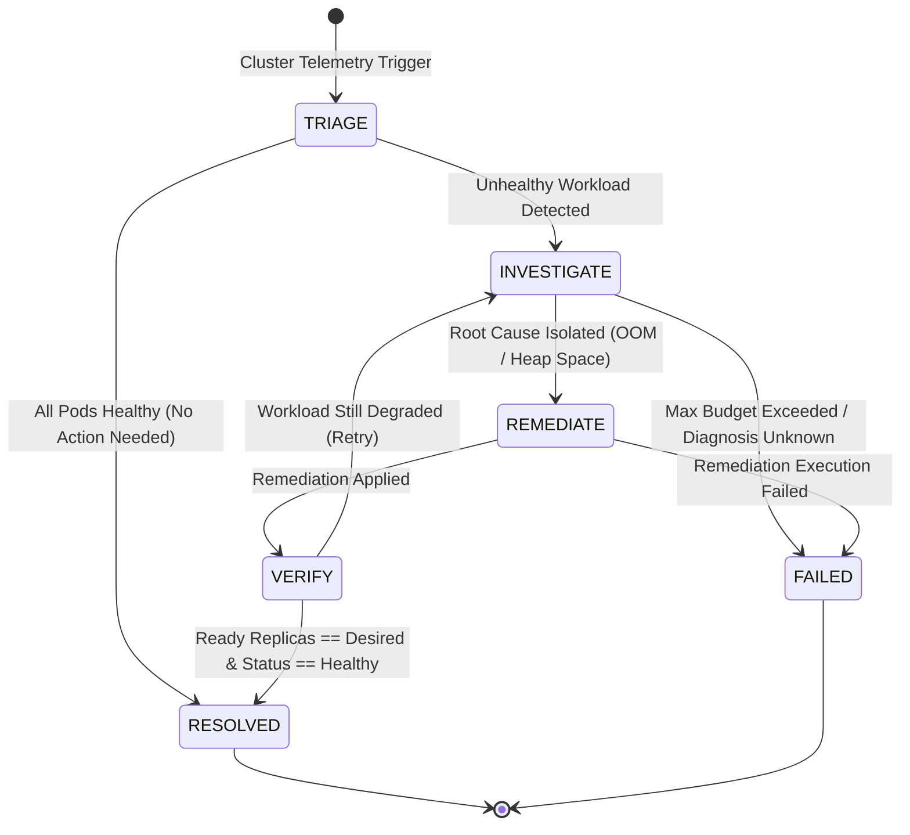

# Kubernetes FSM Agentic Loop & Self-Healing Engine

An enterprise-grade, Finite State Machine (FSM) driven agentic loop tailored for Kubernetes log diagnostics and autonomous self-healing. Built with strict adherence to **SOLID design principles**, **Clean Code practices**, **Test-Driven Development (TDD)**, modular state handlers, and a 24/7 background daemon architecture.

---

## Key Features

1. **Deterministic State Transitions (FSM)**:
   - Eliminates hallucination loops, infinite loops, and unguided reasoning common in naive ReAct loops.
   - Bounded turn budgets per state and global execution safeguards.
2. **Dual Mode Execution (Live Cluster + Offline Simulation)**:
   - **Live Mode**: Directly diagnoses and heals live pods in a real Kubernetes / K3s cluster via `kubectl`.
   - **Simulation Mode**: In-memory telemetry simulator for fast offline development and testing.
3. **24/7 Background Daemon / Operator**:
   - Continuous observation loop applying SOLID principles (`IClusterWatcher`, `DaemonEngine`, `IDaemonObserver`).
   - In-cluster execution using Kubernetes `ServiceAccount` and scoped RBAC.
4. **Gated Tool Scoping & Parameter Filtering**:
   - Destructive or mutating remediation actions (`patch_deployment_resources`, `restart_deployment`) can only execute in the `REMEDIATE` state.
   - Robust Adapter Pattern with `inspect.signature` parameter filtering.
5. **Local Model Native (Zero Docker Runner Dependency)**:
   - Directly connects to local Ollama inference (`llama3.1:latest`) over HTTP with auto-detection of the WSL Windows gateway.
6. **Decoupled Architecture (SOLID)**:
   - High-level engine depends strictly on abstractions (`ILLMClient`, `IToolGateway`, `IClusterWatcher`).
   - 100% testable via unit and E2E mocks without requiring active clusters or live LLMs.

---

## State Machine Workflow



---

## Directory Structure

```
code/ai-agentic-loop/
├── Dockerfile                       # Container definition for in-cluster agent
├── requirements.txt                 # Dependencies
├── k8s/
│   ├── failing_payment_service.yaml # Crashing pod deployment manifest (OOMKilled)
│   ├── agent_rbac.yaml              # In-cluster ServiceAccount, ClusterRole, and Binding
│   └── agent_deployment.yaml        # 24/7 Agent Pod Deployment
├── src/
│   ├── core/
│   │   ├── context.py               # AgentContext, AgentState, Blackboard
│   │   ├── interfaces.py            # ILLMClient, IToolGateway, ToolResult (DIP)
│   │   └── fsm_runner.py            # Core FSM Engine with loop budgets
│   ├── handlers/
│   │   ├── base_handler.py          # Abstract BaseStateHandler (LSP, OCP)
│   │   ├── triage_handler.py        # Triage & Workload Assessment
│   │   ├── investigate_handler.py   # Log analysis & root cause isolation
│   │   ├── remediation_handler.py   # Gated self-healing execution
│   │   └── verify_handler.py        # Post-remediation health validation
│   ├── daemon/
│   │   ├── interfaces.py            # IClusterWatcher, IDaemonObserver (ISP, DIP)
│   │   ├── config.py                # DaemonConfig environment loader (SRP)
│   │   ├── polling_watcher.py       # Polling anomaly detection
│   │   ├── daemon_engine.py         # Continuous observation loop coordinator
│   │   └── main_daemon.py           # Daemon entrypoint
│   ├── clients/
│   │   ├── local_ollama_client.py   # Native local HTTP inference client
│   │   ├── mcp_stdio_gateway.py     # MCP Gateway adapter
│   │   └── live_kubectl_gateway.py  # Live cluster kubectl tool gateway
│   └── server/
│       ├── k8s_telemetry.py         # Telemetry repository & simulation model
│       └── mcp_k8s_server.py        # FastMCP Server with OpenTelemetry
├── tests/                           # 1-to-1 Mirrored Test Structure
│   ├── core/
│   ├── handlers/
│   ├── daemon/
│   ├── clients/
│   └── e2e/
├── main.py                          # One-shot CLI Entrypoint
└── README.md
```

---

## Usage

### 1. Run Automated Test Suite (TDD / E2E)
```bash
python -m pytest tests/ -v
```

### 2. Run Autonomous Simulation with Mock LLM
```bash
python main.py --mock-llm --namespace production
```

### 3. Run One-Shot Live Self-Healing on K3s
```bash
python main.py --live-k8s --namespace production --model llama3.1:latest
```

### 4. Deploy 24/7 Self-Healing Agent Pod into Cluster
```bash
# 1. Apply RBAC permissions
kubectl apply -f k8s/agent_rbac.yaml

# 2. Build and tag agent image in local container runtime
docker build -t k8s-self-healing-agent:latest .

# 3. Deploy the agent pod
kubectl apply -f k8s/agent_deployment.yaml

# 4. View real-time agent daemon logs
kubectl logs -f deployment/k8s-self-healing-agent
```
